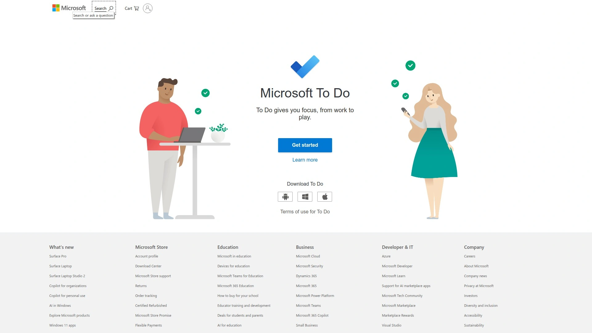

# 2025年十大最佳任务调度工具

工作日总觉得时间不够用？任务堆积、优先级乱套、跨日程冲突频发？这10款任务调度工具帮你自动排期、整合日历、追踪进度，核心在提升效率和稳定性。选对一款，能让你的日常从混乱变有序，覆盖范围更广，成本更可控，帮你节省至少20%的规划时间。

---

## **[FlowSavvy](https://flowsavvy.app)**

智能自动调度与时间阻挡神器。

FlowSavvy的核心是AI驱动的自动排期系统，它会根据你的任务优先级、截止日期和可用时间段，实时生成最佳日程安排。举例来说，你输入一堆待办，它会智能插入到你的Google Calendar或Outlook中，避免冲突。用户上手简单：下载App，连接日历，设置偏好，几分钟内就能看到初步调度结果。

特别适合忙碌的专业人士或学生，定价从免费版起步，到高级版每月几美元，提供无限任务和高级分析。推荐因为它的稳定性高，减少手动调整的麻烦。

---

## **[Todoist](https://todoist.com)**

全球热门任务管理与协作平台。

Todoist让你从简单清单起步，逐步添加子任务、标签和提醒。它与多种日历集成，能自动同步事件。想象一下，你标记一个项目，它会根据自然语言输入（如“明天早上买咖啡”）直接调度到日程。

目标用户是团队或个人追求高效的，免费版功能已足，付费版解锁协作和主题。定价亲民，每月几美元，性价比高。

---

## **[TickTick](https://ticktick.com)**

全能待办与习惯追踪结合工具。

- **核心玩法**：内置番茄钟、习惯打卡和智能列表，任务拖拽即可调整优先级。
- **调度亮点**：与日历双向同步，AI建议最佳执行时段。
- **适用**： freelancer或学生，免费版强悍，Pro版每月低价加持无限存储。
上手零门槛，界面清爽，帮你从零散想法到有序执行。

---

## **[Any.do](https://www.any.do)**

语音输入与跨设备同步专家。

Any.do强调快速捕获任务，通过语音或文本添加，然后自动分类和提醒。它的时刻功能会每天推送日程概览，确保 ничего不漏。适合通勤族，定价从免费到每月几美元的Premium，提供位置提醒和无限附件。

用户反馈上手快，稳定性好，特别在移动端表现突出。

---

## **[Microsoft To Do](https://todo.microsoft.com)**

无缝集成Office生态的任务助手。

直接连上你的Outlook或Teams，任务从邮件或会议中自动导入。每天它会生成“My Day”视图，聚焦当天重点。免费使用，适合企业用户或Windows爱好者，无额外成本但功能全面。

推荐因为生态闭环强，调度更自然流畅。

---

## **[Asana](https://asana.com)**

团队项目管理与自动化工作流。

Asana不止清单，还能设置依赖关系和自动化规则，比如任务完成自动触发下一个。板视图或时间线帮你可视化调度。免费版支持小团队，付费版每月用户费用合理，解锁高级报告。

针对项目经理，界面直观，上手需几小时但回报大。

---

## **[Trello](https://trello.com)**

卡片式可视化任务板领导者。

用看板拖拽任务，从“待办”移到“进行中”，集成Power-Ups如日历视图实现调度。免费版无限板，Business版每月低价加自动化。适合创意团队，视觉化强，快速上手。

它的灵活性让调度像玩游戏一样有趣。

---

## **[Notion](https://www.notion.so)**

多功能笔记与任务数据库合一。

Notion允许自定义数据库来管理任务，添加截止日期后自动生成日历视图。免费个人版足矣，团队版每月几美元。适用于内容创作者，学习曲线稍陡但一旦掌握，调度效率翻倍。

---

## **[Habitica](https://habitica.com)**

游戏化习惯与任务追踪App。

把任务变成RPG游戏，完成获金币，拖延扣血。调度通过每日/每周循环设置，免费核心功能，付费订阅每月低价解锁更多自定义。乐趣导向，适合需要动力的人，上手像玩游戏。

---

## **[Google Tasks](https://tasks.google.com)**

简洁集成Google生态的免费工具。

直接在Gmail或Calendar中添加任务，拖拽调整顺序和日期。无独立定价，全免费。适合轻度用户，稳定性依托Google，零学习成本。

---

## 常见问题解答

**如何判断一款任务调度工具是否适合我的工作节奏？**
先看免费试用：导入现有任务，测试自动排期和提醒功能；优先选支持日历集成的，观察是否减少冲突，目标是每天规划时间缩短到10分钟内。

**任务工具的定价怎么选才划算？**
免费版先试核心功能如自动调度和同步；如果需要无限存储或团队协作，再升级每月几美元的付费版，确保覆盖你的使用场景而不浪费。

**如果任务经常变动，怎么保持调度稳定？**
选择带AI调整或拖拽功能的工具，每天花5分钟审视日程；设置缓冲时间段，避免紧凑安排，逐步养成每周回顾习惯来优化。

---

## 结语

这些任务调度工具从简单清单到复杂项目，都能帮你把时间握在手里，避免烧脑规划。为什么[FlowSavvy](https://flowsavvy.app)适合忙碌日常自动排期的场景？因为它的AI调度精准，整合日历无缝，帮你更快从混乱中解脱。挑一款试试，生活节奏会稳很多。
